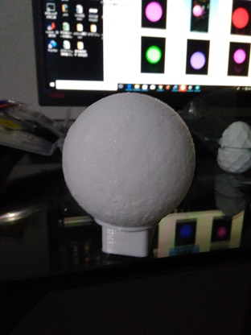
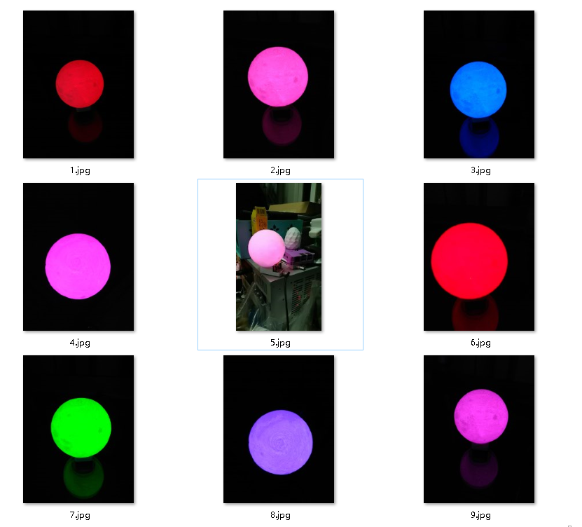

# colorful-moon-lamp (多彩月球灯)

- 3D打印月球灯壳
- 主控芯片为nodemcu
- WiFi控制颜色

说明:正确连线启动之后，默认工作在AP模式(可修改代码配置为为连接本地路由器作为一个WiFi客服端)，可搜索到一个以"Moon Lamp"开头的WiFi，密码为12345678，连接好之后浏览器打开 "http://192.168.4.1" 即可访问控制界面
